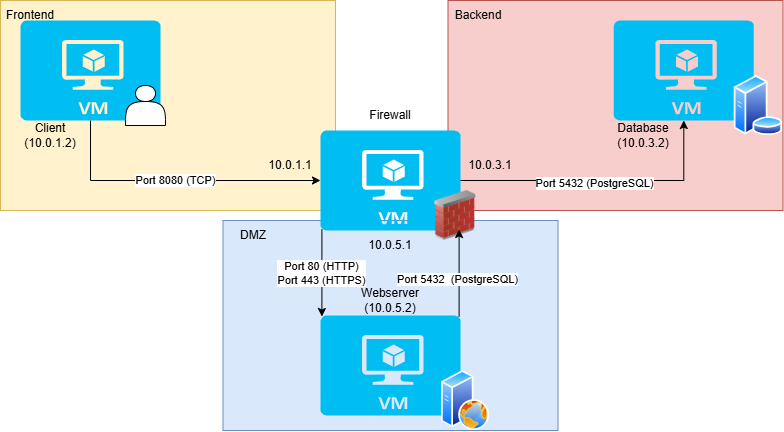

# Projekt 1: Double-Homed Firewall Lab

> En automatiserad nätverksinfrastruktur som sätter upp en säker miljö med en brandvägg som gateway.

---

## Innehållsförteckning

- [Topologi](#topologi)
- [Miljöer och IP-adresser](#miljöer-och-ip-adresser)
- [Mappstruktur](#mappstruktur)
- [Komponenter](#komponenter)
- [Krav och förutsättningar](#krav-och-förutsättningar)
- [Kom igång](#kom-igång)
- [Secrets](#secrets)
- [Säkerhetsåtgärder](#säkerhetsåtgärder)
- [Säkerhetsanalys](#säkerhetsanalys)
- [Verifiering](#verifiering)
- [Designval och motivering](#designval-och-motivering)

---

## Topologi


----

## Miljöer och IP-adresser

| VM | Roll | IP-adress | Port forwarding | Beskrivning |
|---|---|---|---|---|
| `firewall` | Brandvägg | Frontend: 10.0.1.1, DMZ: 10.0.5.1, Backend: 10.0.3.1 | `:80 → host:8080` | Tar emot trafik från hosten och skickar vidare till webbservern |
| `client` | Användare | 10.0.1.2 | — | Host-datorn som testar systemet |
| `webserver` | Webbserver | 10.0.5.2 | — | Kör Nginx och visar hemsidan |
| `database` | Databas | 10.0.3.2 | — | Lagrar data, isolerad från internet |

---

## Mappstruktur

```

Project-1---Double-homed-firewall/
├── ansible/
│   ├── roles/
│   │   ├── client/          # Konfiguration för klient-maskinen
│   │   │   └── tasks/
│   │   │       └── main.yml
│   │   ├── common/          # Gemensamma inställningar för alla noder
│   │   │   └── tasks/
│   │   │       └── main.yml
│   │   ├── database/        # Installation och setup av PostgreSQL
│   │   │   ├── handlers/
│   │   │   │   └── main.yml
│   │   │   ├── tasks/
│   │   │   │   └── main.yml
│   │   │   └── templates/
│   │   │       └── pg_hba.conf.j2
│   │   ├── firewall/        # Konfiguration av nätverk och säkerhetsregler
│   │   │   └── tasks/
│   │   │       └── main.yml
│   │   ├── flask/           # Driftsättning av Python-appen och Gunicorn
│   │   │   ├── defaults/
│   │   │   │   └── main.yml
│   │   │   ├── files/
│   │   │       ├── app.py
│   │   │       └── requirements.txt
│   │   │   ├── handlers/
│   │   │   │   └── main.yml
│   │   │   ├── tasks/
│   │   │   │   └── main.yml
│   │   │   └── templates/
│   │   │       └── flask.service.j2
│   │   └── nginx/           # Installation av Nginx som Reverse Proxy
│   │       ├── handlers/
│   │       │   └── main.yml
│   │       ├── tasks/
│   │       │   └── main.yml
│   │       └── templates/
│   │           └── nginx.conf.j2
│   ├── vars/
│   │   ├── main.yml         # Globala variabler (IP-adresser, portar)
│   │   ├── secrets.yml      # GITIGNORERAD — känsliga lösenord
│   │   └── secrets_example.yml # Mall för lösenord (utan riktiga värden)
│   ├── ansible.cfg          # Inställningar för Ansible-körningen
│   ├── inventory.ini        # Definition av noder och IP-adresser
│   └── site.yml             # Master playbook som kör alla roller
│
├── docs/
│   └── Topologi.png         # Nätverksdiagram över labbmiljön
│
├── test/
│   └── verify.sh            # Script för automatiserad verifiering   
│
├── .gitignore               # Exkluderar känsliga filer från Git
├── README.md                # Projektdokumentation (denna fil)
└── Vagrantfile              # Definition av virtuella maskiner och nätverk

```
---

## Komponenter

### Vagrantfile 

Definierar fyra virtuella maskiner i VirtualBox som är uppdelade i tre separata interna nätverk (intnet) för att skapa en realistisk nätverkstopologi.
- Firewall-VM: Fungerar som en gateway med tre gränssnitt: frontend-net (10.0.1.1), dmz-net (10.0.2.1) och backend-net (10.0.3.1). 
- Klient-VM: Placerad i frontend-net (10.0.1.2).  
- Webbserver-VM: Placerad i dmz-net (10.0.2.2).  
- Databasserver-VM: Placerad i backend-net (10.0.3.2).  
Windows-hosten är helt isolerad från dessa nätverk, vilket tvingar all trafik att passera brandväggen.

### ansible.cfg

Ser till att Ansible alltid använder samma regler när den konfigurerar miljön, oavsett vilken dator du kör ifrån. Kontrollerar anslutningsmetoder och rättigheter. Den pekar på inventory.ini och anger var alla säkerhetsroller finns.

### inventory.ini

Grupperar maskinerna utifrån deras funktioner: [firewall], [webserver], [database] och [client]. Detta gör det möjligt för Ansible att applicera specifika säkerhetskonfigurationer, såsom brandväggsregler, på rätt maskin.

### site.yml (Playbook)

Orkestrerar driftsättningen i en logisk ordning för att säkerställa att beroenden uppfylls:
1. Brandvägg: Konfigureras först med IP-forwarding och routing-regler.  
2. Databas: Sätts upp med PostgreSQL och UFW-regler för att endast tillåta trafik från DMZ.
3. Webbserver: Installerar webbtjänsten och konfigurerar anslutningen mot databasen. 
4. Klient: Konfigureras för att kunna nå webbtjänsten via brandväggen.

### Rollen firewall

Detta är hjärtat i projektet. Rollen aktiverar IP-forwarding i kärnan och använder iptables eller nftables för att styra trafiken. Den tillåter HTTP/HTTPS-trafik från klienten till webbservern och databastrafik (port 5432) från webbservern till databasen, medan all annan trafik mellan zonerna blockeras.

### Rollen flask (Webbserver)

Isolerar applikationen i ett virtual environment (/opt/flask/venv) och körs som en begränsad systemd-tjänst med Restart=always. Installerar Python 3, Gunicorn och beroenden från requirements.txt.

### Rollen database

Installerar och härdar PostgreSQL. Den konfigurerar pg_hba.conf för att endast tillåta anslutningar från webbserverns specifika IP (10.0.2.2) och aktiverar en lokal brandvägg (UFW) som agerar som ett extra skyddslager (Defense in Depth).

### Flask-applikationen (app.py)

En specialskriven applikation som används för att verifiera kedjan. Den innehåller endpoints för:
- Databasverifiering: Testar att webbservern kan skriva till och läsa från databasen i backend-zonen.  
- Systeminfo: Visar hostname för att bekräfta vilken zon som svarar.
- Health Check: Används för att verifiera att tjänsten är uppe och nåbar genom brandväggen.

---

## Krav och förutsättningar

**Programvara som måste vara installerad på Windows-hosten:**

- [Oracle VirtualBox](https://www.virtualbox.org/) - testat med version 7.x
- [Vagrant](https://developer.hashicorp.com/vagrant/install) - testat med version 2.x
- [Git](https://git-scm.com/)

**Hårdvarukrav:**

- Minst 8 GB RAM, men 16 GB är rekommenderat (projektet använder totalt cirka 3 GB)
- Minst 20 GB ledigt diskutrymme

**Nätverkskonfiguration:**

- Internetåtkomst

**Projektspecifika filer:**

- Secrets-fil: Man behöver manuellt skapa filen ansible/vars/secrets.yml på datorn. Denna fil ska innehålla känslig information som lösenord och ska aldrig laddas upp till Git.

---

## Kom igång

```bash

# 1. Klona repot
git clone git@github.com:DoomPlayya/Project-1---Double-homed-firewall.git
cd Project-1---Double-homed-firewall

# 2. Skapa maskinerna (utan att konfigurera dem än)
cd vagrant
vagrant up --no-provision

# 3. Kontrollera att maskinerna är igång
vagrant status

# 4. SSH in i brandväggen
vagrant ssh firewall

# 5. Installera Ansible inuti brandväggen
sudo apt update
sudo apt install git
sudo apt install -y ansible 

# 6. Skapa secrets.yml fil
git clone -b master https://github.com/DoomPlayya/Project-1---Double-homed-firewall.git
cd Project-1---Double-homed-firewall
cd ansible
cd vars
nano secrets.yml
# Kopiera in och lägg till egna värden
valut_db_password:"Skriv_nytt_lösenord"

# 7. Kör konfigurationen
cd ..
ansible-playbook -i inventory.ini site.yml -e "@vars/secrets.yml"

# 8. Verifiera att allt fungerar
bash test/verify.sh

```

---

## Secrets

I detta projekt hanteras känslig information, såsom databaslösenord och SSH-nycklar, med hög säkerhet för att förhindra att de hamnar i versionshanteringen.

**Hantering av känslig data**

Vi använder en gitignore strategi för att hantera lokala hemligheter. Filen ansible/vars/secrets.yml innehåller de faktiska lösenorden och läses in av Ansible under körning, men filen laddas aldrig upp till GitHub.

**Varför lagras inte secrets i Git?**

Att checka in lösenord i ett publikt (eller privat) repo är en stor säkerhetsrisk. Om en angripare får tillgång till koden skulle de direkt kunna logga in i databasen. Genom att separera konfiguration från hemligheter följer projektet principen om Configuration Hardening.

**Instruktion för användare**

1. Skapa filen ansible/vars/secrets.yml
2. Fyll i egna värden
3. Verifiera att filen är listad i projektets .gitignore.

---

## Säkerhetsåtgärder

**Säkerhetsåtgärder (Automatiserade via Ansible)**

| Åtgärd | Var | Hur verifieras det |
|---|---|---|
| IP-Forwarding | Firewall.VM | `cat /proc/sys/net/ipv4/ip_forward` (Värdet ska vara 1 om IP-Forwarding är påslaget) |
| Nätverksisolation | Alla zoner (Frontend, DMZ, Backend) | Ping mellan `client` och `database` ska misslyckas |
| Trafikstyrning (iptables/nftables) | Firewall-VM | `sudo iptables -L -n -v` visar träffar på regler för port 80/443 och 5432 |

---

## Säkerhetsanalys

### Kvarvarande brister

**Brist 1: Firewall-VM som Single Point of Failure (SPoF)**

Om brandväggen får ner, stannar all trafik mellan zonerna.

*Åtgärd:* Implementera redundans genom att ha två brandväggar med samma konfiguration.

*Accepterat i denna miljö:* eftersom detta är en labbmiljö fokuserad på logik och nätverksegmentering snarare än driftssäkerhet och upptid, fungerar det att ha en enskild brandvägg.

---

**Brist 2: Okrypterad trafik mellan webbserver och databas**

Även om brandväggen begränsar trafiken till port 5432, skickas data mellan webbservern och databasen i klartext över det interna nätverket (backend). En angripare som lyckas avlyssna trafiken i den zonen kan läsa känslig information.

*Åtgärd:* Konfigurera PostgreSQL att endast acceptera anslutningen via SSL/TLS och se till att webbservern verifierar databasens certifikat.

*Accepterat i denna miljö:* Backend-nätverket (10.0.3.0/24) är ett strikt isolerat internt nätverk dom saknar exponering mot internet. Åtkomst kräver fysisk tillgång till värddatorn. I denna labbmiljö bedöms risken för avlyssning (sniffing) på interna segment som vara låg, och fokus har lagts på nätverkssegmentering snarare än kryptering.

---

**Brist 3: Brist på centraliserad loggning av brandväggshändelser:**

Brandväggen filterar trafik, men loggarna lagras lokalt på brandväggsmaskinen. Om en angripare tar kontroll över brandväggen kan angripare radera spåren av sina intrång, vilket gör incidentrespons omöjlig.

*Åtgärd:* Implementera en central loggserver i en separat zon dit brandväggen skickar alla iptables-loggar i realtid.

*Accepterat i denna miljö:* Ja, då projektets omfattning främst gäller automatisering (Ansible) och grundläggande säkerhetsskydd, inte avancerad säkerhetsövervakning.

---

### Vad som skyddar miljön

Trots de identifierade bristerna har infrastukturen flera robusta skyddslager som samverkar för att minimera risken:

- Genom att använda en dedikerad firewall-VM med tre separata nätverksgränssnitt tvingas all trafik mellan zonerna (Frontend, DMZ, Backend) att passera en central kontrollpunkt.
- Databasservern ör placerad i ett hekt isolerat backend-nätverkt som saknar direktontakt med både klientnätverket och internet.
- Brandväggen är konfigurerad med en Default Deny-policy, vilket innebär att all trafik blockeras förutom den som uttryckligen tillåtits.
- Varje zon och maskin har endast de rättigheter som krävs för dess specificka funktion, det vill säga Least Privilege-principen. Exempelvis kan klienten nå webbservern, men har ingen teknisk möjlighet att ens pinga databsen.
- Inga lösenord eller konfidentiella uppgifter lagras i GitHub. Istället används gitignore och en secrets.yml-fil som inte gör att känslig information laddas upp på GitHub.
- Eftersom hela miljön är definierad i kod kan en komprometterad maskin enkelt förstöras och återskapas till ett garanterat säkert tillstånd.

---

## Verfiering

För att säkerställa att infrastrukturen är korrekt konfigurerad och att säkerhetsreglerna efterlevs används ett automatiserat verifieringsskript. Detta skript körs inifrån brandväggen för att testa anslutningar mellan de olika zonerna (frontend-net, dmz-net och backend-net).

**Köra verifieringsskriptet**
Logga in på brandväggen och kör skriptet:

```bash

vagrant ssh firewall
cd /vagrant
bash test/verify.sh

```

**Tester som genomförs**
Skriptet kontrollerar följande flöden för att säkerställa att nätverkssegmenteringen fungerar enligt design.

| Testmoment | Metod | Förväntat resultat | Beskrivning |
|---|---|---|---|
| Webbserver-test | `curl -l http://10.0.3.2/health` | HTTP 200 OK | Verifierar att Nginx/Flask-tjänsten i DMZ-zonen är aktiv och nårbar genom brandväggen. |
| Databas-anslutning | `nc -zv 10.0.3.2 5432` | Succeeded | Bekräftar att brandväggen tillåter trafik på port 5432 och att PostgreSQL-tjänsten lyssnar i backend-nätet. |
| Tjänsteverifiering | `systemctl is-active flask` | active | Använder Ansible för att bekräfta att Flask-applikationen faktiskt körs som en systemd-tjänst på målmaskinen. |
| Nätverksisolation | `ping 10.0.3.2` (från Klient) | Destination Host Unreachable | Verifierar att klienten i frontend-nätet inte kan nå backend-zonen direkt utanför tillåtna regler. |

**Manuella kontroller**
Utöver det automatiserade skriptet kan följande kommandon köras på brandväggen för att inspektera den aktiva trafiken:

Visa aktiva brandväggsregler och träffstatistik:
- `sudo iptables -L -n -v`   
- Kontrollera routing-tabellen:
`ip route`
- Verifiera IP-forwarding:
`cat /proc/sys/net/ipv4/ip_forward` (ska returnera 1)

---

## Designval och motivering

### Varför en Double-homed Firewall-arkitektur?

Hjärtat i projektet är en brandvägg med tre separata nätverksgränssnitt (frontend-net, dmz-net och backend-net). Genom att använda denna arkitektur istället för en enkel router tvingas all trafik att passera en central inspektionspunkt. Detta förhindrar att en angripare kan röra sig fritt mellan zoner (sidledsförflyttning) och ger oss full kontroll över vilka paket som tillåts flöda mellan klienten och de interna servrarna.

### Varför använda interna nätverk (intnet) istället för host-only?

Vi har valt att använda VirtualBox intnet (interna nätverk) istället för host-only för kommunikationen mellan de virtuella maskinerna. Detta val görs för att säkerställa att Windows-värddatorn inte är en del av labbnätverket. Genom att fysiskt separera labbmiljön från värdmaskinens nätverk skapas en säker labbmiljö där tester kan genomföras utan att riskera värddatorns säkerhet.

### Varför separata VMs och isolerade nätverk?

Att köra Flask och PostgreSQL på samma maskin hade varit resursbesparande, men det hade eliminerat nätverkssegmenteringen. Infrastrukturen är uppdelad i tre isolerade zoner: Frontend (Klient), DMZ (Webbserver) och Backend (Databas). Detta val baseras på principen om Defense in Depth, där varje lager fungerar som en oberoende barriär. Genom att placera databasen i ett backend-nätverk som helt saknar kontakt med klientnätverket minimeras attackytan mot systemets mest känsliga data.

### Varför automatiserad orkestrering via Ansible?

Ett strategiskt val har varit att låta Ansible sköta all konfiguration av maskinerna inifrån brandväggen. Detta säkerställer idempotens, vilket innebär att miljön kan återskapas till exakt samma säkra tillstånd oavsett utgångsläge. Genom att automatisera installationen av tjänster som PostgreSQL och Flask minskar risken för mänskliga konfigurationsfel, vilket är en vanlig källa till säkerhetsbrister.

### Varför systemd-tjänst för Flask-applikationen?

Istället för att starta Flask-appen manuellt i en terminal används en systemd-unit. Detta val görs för att säkerställa att applikationen är robust och driftsäker. Med konfigurationen Restart=always startar tjänsten automatiskt om vid en eventuell krasch eller om maskinen startas om, vilket är ett krav för automatiserade driftfunktioner i en professionell miljö.

### Tillämpning av Least privilege-principen

Varje nätverksregel i brandväggen är konfigurerad enligt Least privilege-principen. Istället för att tillåta all trafik mellan zoner har vi valt att endast öppna de specifika portar som krävs för att tjänsterna ska fungera: port 80/443 för webbtrafik och port 5432 för databaskommunikation. All annan trafik blockeras som standard (Default Deny), vilket är en kritisk säkerhetsåtgärd för att begränsa verkan av en eventuell kompromettring.  

### Varför miljövariabler istället för hårdkodning?

Flask-applikationen är designad för att läsa in databasens lösenord och IP-adress via miljövariabler. Detta gör koden portabel och säker. Genom att injicera dessa värden via Ansible (från vår secrets.yml) kan samma kod köras i olika miljöer utan att känslig information någonsin lagras i själva källkoden, vilket är en central princip inom säkerhetsarkitektur.

---

*Skapad av: Elsa Grahn och Ida-Marie Näsström-Öqvist*
*Kurs: Virtualiseringsteknik*
*Datum: 2026-05-22*